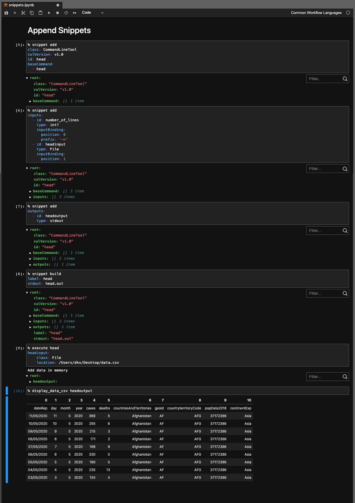

# Jupyter Notebook Kernel for Common Workflow Language 

This is a jupyter notebook kernel which enables running Common Workflow Language. It uses 
[cwltool](https://github.com/common-workflow-language/cwltool) as the execution engine. The goal of the kernel is to 
improve the human-in-the-loop interaction. The goal of the kernel is to improve human-in-the-loop by improving the 
following:
* Documenting the workflow
* Enable the developer to execute a workflow with multiple steps splited in multiple JN cells
* Enable the user to execute multiple workflows stitched together
* Ensembl workflows
    * Run the same workflow many times over different datasets or with different settings over the same data sets
    * Run different workflows over the same datasets

`Currently windows are not supported`

## Examples
In examples directory there are many examples which illustrate how to use the kernel. 

## How to contribute
If you are a CWL developer and you would like to contribute feel free to open an issue and ask for new features you 
would like to see. 
